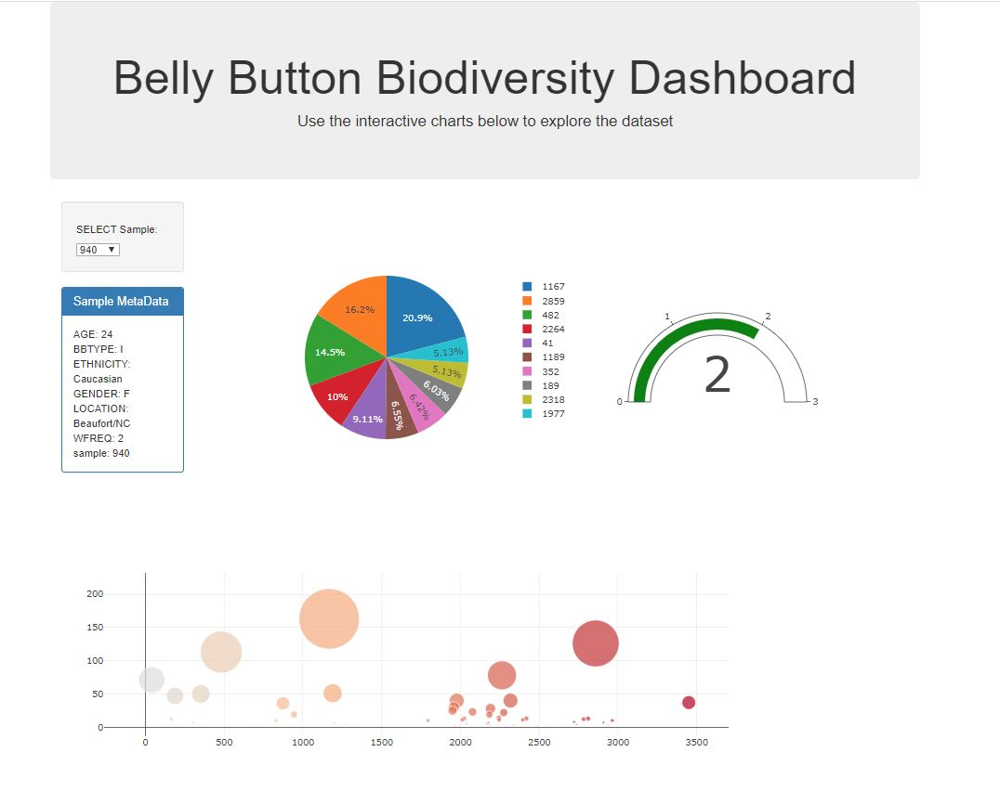

<strong>Starter code was provided as this was an acedemic assignment</strong> 
Web Dashboard using Javascript, Plotly, D3 and PostgreSQL 
 
Interactive dynamic graphs displaying information from a database! 
 
<strong>To Run Code:</strong> 
Clone Repository 
Run app.py file located in the below folder: 
plotly-challenge-adams100/StarterCode/Belly_Button_Biodiversity/app.py 
Navigate to: http://localhost:5000 in a web browser 
 
<strong>Project shows implementation of plotly interactive graphs via connection to a database and displayed on a web frontend.</strong> 
 
Below images show the displayed dashboard: 
 

